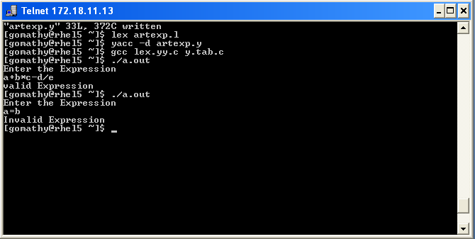

# Output — Ex.No 3



```
"artexp.y" 33L, 372C written
[gomathy@rhel5 ~]$ lex artexp.l
[gomathy@rhel5 ~]$ yacc -d artexp.y
[gomathy@rhel5 ~]$ gcc lex.yy.c y.tab.c
[gomathy@rhel5 ~]$ ./a.out
Enter the Expression
a+b*c-d/e
valid Expression
[gomathy@rhel5 ~]$ ./a.out
Enter the Expression
a=b
Invalid Expression
[gomathy@rhel5 ~]$
```

**Result:** Thus the program to recognize a valid arithmetic expression that uses operator +, - , * and /
using YACC tool was executed and verified successfully.
