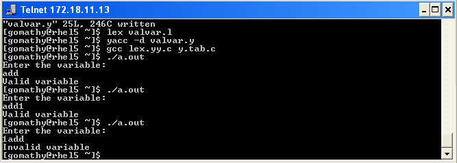

# Output — Ex.No 4



```
"valvar.y" 25L, 246C written
[gomathy@rhel5 ~]$ lex valvar.l
[gomathy@rhel5 ~]$ yacc -d valvar.y
[gomathy@rhel5 ~]$ gcc lex.yy.c y.tab.c
[gomathy@rhel5 ~]$ ./a.out
Enter the variable:
add
Valid variable
[gomathy@rhel5 ~]$ ./a.out
Enter the variable:
add1
Valid variable
[gomathy@rhel5 ~]$ ./a.out
Enter the variable:
1add
Invalid variable
[gomathy@rhel5 ~]$
```

**Result:** Thus the program to recognize a valid variable which starts with a letter followed by any
number of letters or digits using YACC tool was executed and verified successfully.
