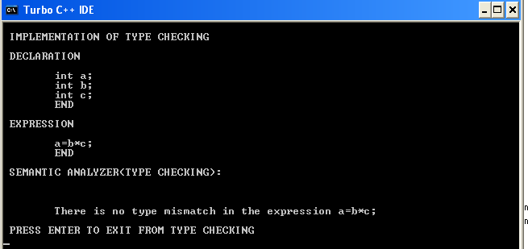
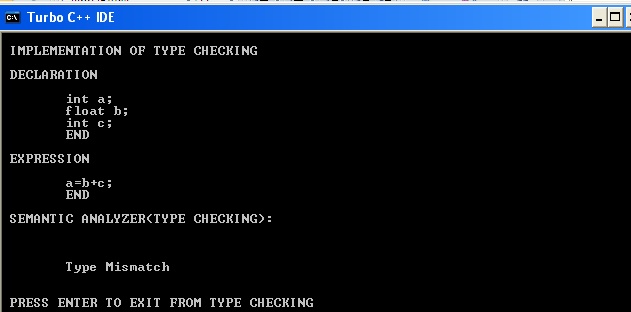

# Output — Ex.No 8

### Case 1 — No type mismatch


```
IMPLEMENTATION OF TYPE CHECKING
DECLARATION
    int a;
    int b;
    int c;
    END
EXPRESSION
    a=b*c;
    END
SEMANTIC ANALYZER(TYPE CHECKING):
    There is no type mismatch in the expression a=b*c;
PRESS ENTER TO EXIT FROM TYPE CHECKING
```

### Case 2 — Type mismatch


```
IMPLEMENTATION OF TYPE CHECKING
DECLARATION
    int a;
    float b;
    int c;
    END
EXPRESSION
    a=b+c;
    END
SEMANTIC ANALYZER(TYPE CHECKING):
    Type Mismatch
PRESS ENTER TO EXIT FROM TYPE CHECKING
```

**Result:** Thus, the C program for type checking was successfully implemented. The program verifies
variable types from declarations and checks type consistency in given expressions using a symbol
table.
