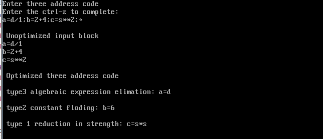

# Output — Ex.No 9



```
Enter three address code
Enter the ctrl-z to complete:
a=d/1;b=2+4;c=s**2;

Unoptimized input block
a=d/1
b=2+4
c=s**2

Optimized three address code

type3 algebraic expression elimation: a=d

type2 constant floding: b=6

type 1 reduction in strength: c=s*s
```

> Note: this screenshot is from an earlier reference version of the program (different variable
> ordering/messages). Running `code_optimization.c` in this repo on the sample input below produces
> equivalent optimizations with slightly different message wording:
>
> **Sample input:**
> ```
> a=2+4;
> b=d*1;
> c=s*2;
> ```
> **Sample output:**
> ```
> a=6;    // Constant Folding
> b=d;    // Algebraic Simplification (X*1 or X/1)
> c=s+s;  // Strength Reduction (X*2 to X+X)
> ```

**Result:** Thus, the C program for simple code optimization techniques like constant folding,
strength reduction, and algebraic simplification was successfully implemented and tested with
various inputs.
